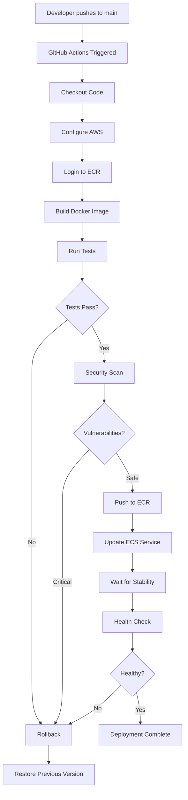

# CI/CD Pipeline Flow

```mermaid
flowchart TD
    A[Developer pushes to main] --> B[GitHub Actions Triggered]
    B --> C[Checkout Code]
    C --> D[Configure AWS]
    D --> E[Login to ECR]
    E --> F[Build Docker Image]
    F --> G[Run Tests]
    G --> H{Tests Pass?}
    H -->|No| Z[Rollback]
    H -->|Yes| I[Security Scan]
    I --> J{Vulnerabilities?}
    J -->|Critical| Z
    J -->|Safe| K[Push to ECR]
    K --> L[Update ECS Service]
    L --> M[Wait for Stability]
    M --> N[Health Check]
    N --> O{Healthy?}
    O -->|No| Z
    O -->|Yes| P[Deployment Complete]
    Z --> Q[Restore Previous Version]
```